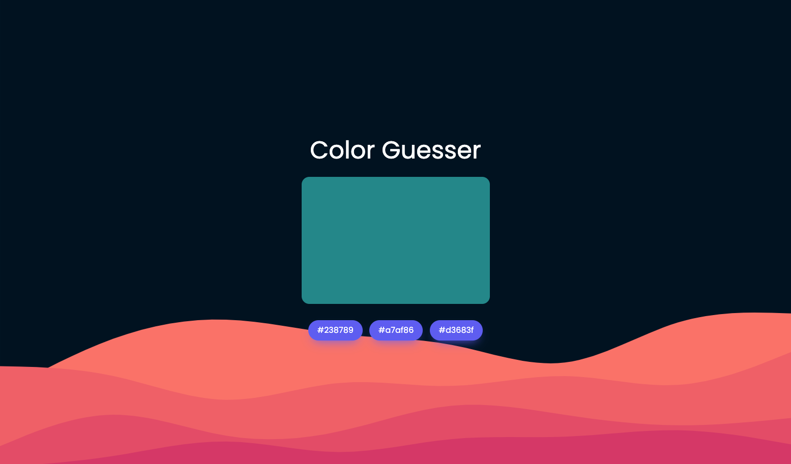

## Color Guesser

A simple game where you have guess the color's hex value.
A fun project to practice React fundamentals.

## Mistakes Made

One of the mistakes I made was attempting to make the code as modular as possible from the very beginning of the project. This approach made writing the core logic difficult, and I ended up implementing a convoluted logic that wasn't fully correct. Later, after watching Cody's video on the same topic, I rewrote the entire code as a single-file component, which was much easier to work with.

## Resources

- This amazing challenge was posted by Cody. Please do check out his [video](https://youtu.be/QNYljS0_TOE?list=PL6x5Q-Sj_Bla3_wMqhETxMBjFml0XJNPI).
- Site for great [Background SVGs](https://app.haikei.app)